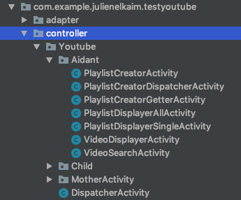

# Projet Android ENAP: V 1.0.0
<br>
<br>
## Contexte et objectifs du projet

L'application a pour objectif de permettre aux autistes de profiter des ressources d'internet dans le cadre d'un apprentissage encadré. ses objectifs sont : 
<br>
<br>

____
<br>
**Premier objectif:** simplifier les interfaces des sites internets les plus visités pour éviter aux enfants de souffrir de la surcharge d'information que l'on trouve sur les sites d'information.  
**Sites traités en v1.0.0:**  
- Wikipédia [Voir plus](#Wiki_Part)   
- Youtube [Voir plus](#Youtube_Part) 
<br>
____
<br>
**Second objectif:** proposer un système de messagerie simplifié, adapté à des enfants non communicants. [Voir plus](#Mails_Part)
<br>
____

<br>
<br>
## Auteurs

Convention : *Author - email address : speciality*

### ENAP -v 1.0.0
__________________________________
<br>
**Julien Elkaim**   - julienelk@gmail.com       : Youtube **[Nb: 3A Nancy 2019 - 2020]**  
**Rayan Zaibet**    - rayananana@gmail.com      : Wikipédia  
**Mathis Fouques**  - mathis@gmail.com          : Mails  
<br>
__________________________________
<br>
v 2.X.X - 2A en 		*2019 - 2020*  
<br>
__________________________________


<br>
<br>
## Conventions du projet

<br>
**Architecture**: L'architecture des projets Android est directement inspirée de l'architecture MVC. Pour en savoir plus sur la MVC, [Cliquez ici](#mvc_tutorial)  

**D.R.Y** : Don't Repeat Yourself. Si des classes partagent leur logique (Exemple: Deux activités destinées à afficher une liste de vidéos), il vaut mieux créer une classe mère dans le plus de décliner les méthodes, quitte à faire des *overrides*. Pour plus de fluidité dans le parcours des classes, encapsulez ces classes mères dans un sous package **MotherActivity**.

**Nommage explicite** : Toujours choisir des noms de variable et de méthode qui décrivent précisément l'objet et sa fonction. Cela évite de perdre des heures sur la maintenance du code ou voulant intégrer de nouvelles fonctions à un code pré-existant.

**Structrer son code en modules** : Les objets Activity peuvent vite s'accumuler et rendre le dossier des *controllers* illisible. Pour rendre le parcours du code plus lisible, il faut organiser ses java class en packages. Le choix fait en v 1.0.0 est d'organiser le code par fonctionnalité *(Ex: Youtube, Youtube.Aidant, Wikipédia, Mails, Auth)*. 


 

**Commentaires JavaDocs** : Utilisez en priorité la Java Doc pour exprimer l'utiliter de la fonction, les inputs et outputs. Il faut que pouvoir comprendre la fonction sans avoir à lire le code.
<br>


```java
	/**
	* @author Julien Elkaim
	*
	* Square any integer passed in parameter.
	*
	* @param nb, number to square. 
	* @return number squared by this tremendous function.
	*/
	private int squareIt(int nb){
		return nb*nb;
	}
```

## Tutorials

###<a name="mvc_tutorial"></a> Architecture MVC

L'architecture MVC est très utilisé dans les applications web et mobile. Elle part du principe que le code est beaucoup plus maintenable si les différentes fonctions de l'application sont divisés entre différents objets (Ici, des simples classes Java, ou des fichiers xml):  

**M - Model**, gère les intéractions avec la base de données. Conceptuellement, on considère le modèle comme une interface pour simplifier l'accès aux donnée. Dans les faits, le Model est une simple classe Java. Une fois un objet initialisé avec le patron de cette classe, il est possible de manipuler les informations facilement grâce aux *setters* et aux *getters*. Si il y a besoin d'appliquer des fonctions bien spécifiques à cet objet, il vaut mieux en faire des méthodes.

```java
package com.example.julienelkaim.testyoutube.model.Youtube;

public class Video {

    private String videoId, title, description, url;

    /**
     * @author Julien Elkaim
     *
     * @param videoId is the Youtube ID of this video
     * @param title is the youtube title of this video
     * @param description is the youtube description of this video
     * @param url is the url of this video
     */
    public Video(String videoId, String title, String description, String url) {
        this.videoId = videoId;
        this.title = title;
        this.description = description;
        this.url = url;
    }


    /**
     * @author Julien Elkaim
     *
     * @return youtube id of this video
     */
    public String getVideoId() {
        return videoId;
    }

    /**
     * @author Julien Elkaim
     *
     * @return youtube title of this video
     */
    public String getTitle() {
        return title;
    }

    /**
     * @author Julien Elkaim
     *
     * @return youtube description of this video
     */
    public String getDescription() {
        return description;
    }

    /**
     * @author Julien Elkaim
     *
     * @return url to display video.
     */
    public String getUrl() {
        return url;
    }

}
```

____
### API Requests
____
### Création des vues XML
____
### Utilisation de Firebase
____
### Youtube Librairie
____


## Focus par parties

###<a name="Youtube_Part"></a> Youtube

###<a name="Mails_Part"></a> Mails

###<a name="Wiki_Part"></a> Wikipédia

