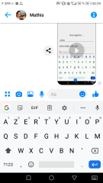

# Projet Android ENAP: V 1.0.0
<br>
<br>  

## Contexte et objectifs du projet

L'application a pour objectif de permettre aux autistes de profiter des ressources d'internet dans le cadre d'un apprentissage encadré. ses objectifs sont : 
<br>
<br>

____
<br>  

**Premier objectif:** simplifier les interfaces des sites internets les plus visités pour éviter aux enfants de souffrir de la surcharge d'information que l'on trouve sur les sites d'information.  
 
**Sites traités en v1.0.0:**  
- Wikipédia [Voir plus](#Wikipédia)   
- Youtube [Voir plus](#Youtube) 
<br>

<br>  

**Second objectif:** proposer un système de messagerie, adapté à des enfants non communicants. [Voir plus](#Messagerie)
<br>
____

<br>
<br>  

## Auteurs

Convention : *Author - email address : speciality*

### ENAP -v 1.0.0
__________________________________
<br>  

**Julien Elkaim**   - julienelk@gmail.com       : Youtube **[Nb: 3A Nancy 2019 - 2020]**  

**Rayan Zaibet**    - rayane.zaibet@mines-nancy.org      : Wikipédia  

**Mathis Fouques**  - maths.fouques@gmail.com         : Messagerie

<br>  

### ENAP -v 2.0.0  

__________________________________  

<br>  

*2019 - 2020*  

<br>  


__________________________________  


<br>
<br>  

## Conventions du projet  


<br>  

**Architecture** : L'architecture des projets Android est directement inspirée de l'architecture MVC. Pour en savoir plus sur la MVC, [Cliquez ici](#Architecture-MVC)  

**D.R.Y** : Don't Repeat Yourself. Si des classes partagent leur logique (Exemple: Deux activités destinées à afficher une liste de vidéos), il vaut mieux créer une classe mère dans le plus de décliner les méthodes, quitte à faire des *overrides*. Pour plus de fluidité dans le parcours des classes, encapsulez ces classes mères dans un sous package **MotherActivity**.

**Nommage explicite** : Toujours choisir des noms de variable et de méthode qui décrivent précisément l'objet et sa fonction. Cela évite de perdre des heures sur la maintenance du code ou voulant intégrer de nouvelles fonctions à un code pré-existant.

**Structrer son code en modules** : Les objets Activity peuvent vite s'accumuler et rendre le dossier des *controllers* illisible. Pour rendre le parcours du code plus lisible, il faut organiser ses java class en packages. Le choix fait en v 1.0.0 est d'organiser le code par fonctionnalité *(Ex: Youtube, Youtube.Aidant, Wikipédia, Mails, Auth)*. 


 

**Commentaires JavaDocs** : Utilisez en priorité la Java Doc pour exprimer l'utiliter de la fonction, les inputs et outputs. Il faut que pouvoir comprendre la fonction sans avoir à lire le code.  
***Exception faite des fonctions en override, Il vaut mieux ne pas overrider la JavaDoc initiale***.
<br>


```java
	/**
	* @author Julien Elkaim
	*
	* Square any integer passed in parameter.
	*
	* @param nb, number to square. 
	* @return number squared by this tremendous function.
	*/
	private int squareIt(int nb){
		return nb*nb;
	}
```  


## Tutorials  


### Architecture MVC  


L'architecture MVC est très utilisé dans les applications web et mobile. Elle part du principe que le code est beaucoup plus maintenable si les différentes fonctions de l'application sont divisés entre différents objets (Ici, des simples classes Java, ou des fichiers xml):  

**M - Model**, gère les intéractions avec la base de données. Conceptuellement, on considère le modèle comme une interface pour simplifier l'accès aux donnée. Dans les faits, le Model est une simple classe Java. Une fois un objet initialisé avec le patron de cette classe, il est possible de manipuler les informations facilement grâce aux *setters* et aux *getters*. Si il y a besoin d'appliquer des fonctions bien spécifiques à cet objet, il vaut mieux en faire des méthodes. **Si l'application était un corps humain, les modèles seraient la mémoire, ou plutôt la partie du cerveau qui gère la mémoire.**
<br>
<br>

```java
package com.example.julienelkaim.testyoutube.model.Youtube;

public class Video {

    private String videoId, title, description, url;

    /**
     * @author Julien Elkaim
     *
     * @param videoId is the Youtube ID of this video
     * @param title is the youtube title of this video
     * @param description is the youtube description of this video
     * @param url is the url of this video
     */
    public Video(String videoId, String title, String description, String url) {
        this.videoId = videoId;
        this.title = title;
        this.description = description;
        this.url = url;
    }


    /**
     * @author Julien Elkaim
     *
     * @return youtube id of this video
     */
    public String getVideoId() {
        return videoId;
    }

    /**
     * @author Julien Elkaim
     *
     * @return youtube title of this video
     */
    public String getTitle() {
        return title;
    }

    /**
     * @author Julien Elkaim
     *
     * @return youtube description of this video
     */
    public String getDescription() {
        return description;
    }

    /**
     * @author Julien Elkaim
     *
     * @return url to display video.
     */
    public String getUrl() {
        return url;
    }

}
```
<br>
<br>

**V - View**, gère l'affichage de notre application. À moins d'avoir besoin de faire de l'affichage dynamique, c'est dans cette partie que vont être géré le contenu visible, la structure de ce contenu et c'est principalement dans la view, que sont gérés les interactions avec l'écran tactile. Les views sont des fichiers xml avec des conventions bien spécifique de nommage. **Si l'application était un corps humain, les views seraient le corps lui même et ses organes, soit la chair et les os.**
<br>
<br>


**C - Controller**, gère toute la logique métier de l'application. Concrètement, c'est ici que l'on définie les actions en réaction à un click d'utilisateur. C'est le **controller** qui demande à un **model** de faire l'interface avec les données pour pouvoir les utiliser et dire à la **view** comment les afficher. Le controller est la partie centrale de l'application, tout ce qui est "comportement", ou "intelligence" se définie ici. Dans android studio, *les controllers sont appelés des Activity*. Une Activity doit toujours hériter d'une classe mère de type Activity fournie par Android. **Si l'application était un corps humain, les controllers seraient le cerveau en excluant la partie mémoire, c'est lui qui dit au corps comment bouger, qui fait appelle à ses souvenirs pour décider ensuite d'agir.

```java
package com.example.julienelkaim.testyoutube.controller.Youtube.Aidant;

import android.content.Intent;
import android.support.v7.app.AppCompatActivity;
import android.os.Bundle;
import android.view.View;
import android.widget.ImageButton;

import com.example.julienelkaim.testyoutube.R;
import com.example.julienelkaim.testyoutube.toolbox.GlobalBox;

public class PlaylistCreatorDispatcherActivity extends AppCompatActivity {

    ImageButton newPlaylistBtn;
    ImageButton actualPlaylistBtn;

    @Override
    protected void onStart() {
        super.onStart();
        GlobalBox.windowAndSystemSettings(this);
    }

    @Override
    protected void onRestart() {
        super.onRestart();
        onBackPressed();
    }

    @Override
    protected void onCreate(Bundle savedInstanceState) {


        super.onCreate(savedInstanceState);
        setContentView(R.layout.activity_playlist_creator_dispatcher); //C'est ici que le controller sait à quelle vue il est associé.

        newPlaylistBtn = findViewById(R.id.new_playlist_btn);
        newPlaylistBtn.setOnClickListener(new View.OnClickListener() {
            @Override
            public void onClick(View v) {
                // Se connecter a l'activité lecteur youtube
                Intent myGame = new Intent(PlaylistCreatorDispatcherActivity.this, PlaylistCreatorActivity.class);
                startActivity(myGame);
            }
        });
        actualPlaylistBtn = findViewById(R.id.actual_playlist_btn);
        actualPlaylistBtn.setOnClickListener(new View.OnClickListener() {
            @Override
            public void onClick(View v) {
                Intent myPlaylists = new Intent(PlaylistCreatorDispatcherActivity.this, PlaylistCreatorGetterActivity.class);
                startActivity(myPlaylists);

            }
        });

    }

    }

```
<br>
<br> 

Si ce tutoriel n'est pas suffisant, n'hésitez surtout pas à me contacter : 
 
``` 
julienelk@gmail.com - 2018		//À mettre à jour tous les ans
```  

<br>
<br>  

____  

### API Requests  

Les requêtes sur API REST se font à travers la librairie **volley**. Le traitement d'une réponse en JSON se fait avec la librairie **gson**.

```gradle
implementation 'com.android.volley:volley:1.1.1'
implementation 'com.google.code.gson:gson:2.8.2'

```  

Volley traite les requêtes de manière asynchrone, c'est à dire que le programme n'attendra pas que l' API lui réponde pour éxécuter le reste du code.

Pour lancer une requête il faut utiliser un objet **RequestQueue** auquel on passe un objet **strinRequest**. Ce dernier utilisera une fonction *(ici, fonctionPourTraiterLaReponseDeLApi)* pour traiter la réponse.

```java
	// Fonction a lancer depuis n'importe quel méthode d'une Activity
	RequestQueue rqQueue = Volley.newRequestQueue(getApplicationContext());
   // Définir les paramètres de requête et la manière de traiter
   StringRequest stringRqQueue = new StringRequest(
                Request.Method.GET,
                mSearchUrl,
                new Response.Listener<String>() {
                    @Override public void onResponse(String response) {
                        fonctionPourTraiterLaReponseDeLApi(response); }
                    },
                new Response.ErrorListener() {@Override public void onErrorResponse(VolleyError error) {
                    Toast.makeText(getApplicationContext(),error.getMessage(), Toast.LENGTH_LONG).show(); } 
                }
        );
        rqQueue.add(stringRqQueue);
```

Ensuite il suffit de traiter la réponse (en JSON si c'est une API REST) dans la fameuse fonction passée, *ici, fonctionPourTraiterLaReponseDeLApi*.  

```java
private void processRequestResponse(String response) {
        try {
            JSONArray jArray = new JSONObject(response).getJSONArray("items");
            // JSONArray or JSONObject depending the JSON root : [] or {}
            //Some stuff on the jArray object
            


        } catch (JSONException e) {
            e.printStackTrace();
           //Or any strange way to handle errors on the JSON object.
        }

    }

```
<br>
<br> 

Si ce tutoriel n'est pas suffisant, n'hésitez surtout pas à me contacter :  
 
``` 
julienelk@gmail.com - 2018 	//À mettre à jour tous les ans
```  

<br>
<br>  
____  

### Création des vues XML

La bonne pratique est de toujours construire une vue **avec** un controller. En effet, 90% du temps vos vues auront besoin d'un controller pour les générer, à moins que vous ne décidiez de faire des *partials*, ce qui est une utilisation avancée des vues.  

Créer un duo View-Controller se fait en deux clicks grâce à Android Studio:  

  

Ils vont ensuite vous demander de nommer votre activity. Ici, suivez simplement la convention de nommage du projet.
<br>
<br> 

Si ce tutoriel n'est pas suffisant, n'hésitez surtout pas à me contacter :  

``` 
julienelk@gmail.com - 2018  	//À mettre à jour tous les ans.
```  

<br>
<br>  

____  

### Utilisation de Firebase


Firebase a été principalement utilisé lors de la partie sur la messagerie.

Firebase est un service proposé par google qui permet de disposer d'un serveur clé-en-main pour les applications mais également les sites internet par exemple.
L'idée de google est de proposer un système simple permettant aux développeurs d'utiliser un serveur.

Sur deux aspects :

 - L'authentification :

 Firebase prend tout en main avec la fonction "CreateAccountWithEmailAndPassword que vous pourrez retrouver dans l'activité RegisterActivity.
 Cependant, il a fallu en amont importer la bibliothèque firebase, google vous demandera de l'updater. Voir la partie sur le gradle pour comprendre les dépendances.

 <br>
 <br>
 private void registerUser(final String display_name, final String email, String password) {

         mAuth.createUserWithEmailAndPassword(email, password).addOnCompleteListener(new OnCompleteListener<AuthResult>() {
             @Override
             public void onComplete(@NonNull final Task<AuthResult> task) {

                 if (task.isSuccessful()) {

                     mRegProgress.dismiss();

                     final FirebaseUser firebaseUser = mAuth.getCurrentUser();
                     assert firebaseUser != null;
                     String userId = firebaseUser.getUid();

                     reference = FirebaseDatabase.getInstance().getReference("Users");
                     reference.push().setValue(new User(userId,display_name,email));

                     Intent mainIntent = new Intent(RegisterActivity.this, DispatcherActivity.class);
                     startActivity(mainIntent);
                     Toast.makeText(RegisterActivity.this, "Bienvenue, "+display_name+" !", Toast.LENGTH_SHORT).show();
                     finish();

                 } else {

                     mRegProgress.dismiss();
                     Toast.makeText(RegisterActivity.this, "Erreur", Toast.LENGTH_LONG).show();
                     Log.w("RegisterActivity", "createUserWithEmail:failure", task.getException());

                 }
             }
         });
     }

 <br>
 <br>

 - La base de données en temps réel :

A chaque authentification on ajouteà la base de données les coordonnées de l'utilisateur pour pouvoir l'utiliser dans le code par la suite. D'autrepart la Database est essentielle pour pouvoir échanger des messages entre utilisateurs.
Une fonction importante :
addValueEventListener() : Vous allez voir une utilisation ci dessous de cette fonction. Son principe est de lire à tout instant la base de donées et de pouvoir effectuer des actions lorsque les données de la base de données ont changé.
Ceci est tiré de la fonction OnCreate() de la ChatActivity

<br>
<br>

//Lecture de la base de données pour pouvoir lire les messages
        reference.addValueEventListener(new ValueEventListener() {
            @Override
            public void onDataChange(@NonNull DataSnapshot dataSnapshot) {
                //readImageMessage(mUserId, mOtherUserId);
                readMessage(mUserId,mOtherUserId);
                mRegProgress.dismiss();
            }

            @Override
            public void onCancelled(@NonNull DatabaseError databaseError) {

            }
        });

<br>
<br>


<br>
<br>

Si ce tutoriel n'est pas suffisant, n'hésitez surtout pas à me contacter :

```
maths.fouques@gmail.com - 2018  	//À mettre à jour tous les ans.
```

<br>
<br>

____  

### Youtube Player - Lib

[Téléchargez la librairie YouTubeAndroidPlayerApi-1](https://developers.google.com/youtube/android/player/downloads/YouTubeAndroidPlayerApi-1.2.2.zip). 

**Pendant le téléchargement**, déplacez vous dans le dossier contenant le projet android (dedans vous trouverez des fichiers/dossiers tel que : app, gradle, build.gradle, etc...). Ici, créez un dossier APIaddedByMe (ou le nom qu'il vous plaira).

**Après le téléchargement**, copiez-collez le dossier téléchargé (**dézippé**) dans APIaddedByMe (ou votre nom de dossier).  

**Une fois le dossier déplacé**, ouvrez le build.gradle de l'application:  

- Graphiquement : Le plus haut au niveau de l'arborescence du projet.  
- Sur Android Studio: Dans la section Gradle Scripts, le fichier build.gradle (Module: app).  

Android Studio vous demandera de réaliser une synchronisation du projet en haut à droite, **lancez la synchronisation**. Une fois terminée, vous êtes capable d'utiliser des objets Youtube Player !  
<br>
<br> 

Si ce tutoriel n'est pas suffisant, n'hésitez surtout pas à me contacter :  

``` 
julienelk@gmail.com - 2018  	//À mettre à jour tous les ans.
```  

<br>
<br>  

____  


## ENAP - Parties  


### Youtube 
 

#### Partie Enfant  

La partie de l'application concernant youtube a comme objectif de retirer toutes les informations marketing du site :  

 <-- Youtube | ENAP -->  


L'objectif est de supprimer le surplus : Les propositions de vidéo, les boutons d'interaction( partager, s'abonner, etc...), les publicités avant et pendant la lecture de vidéo. Le but est donc de proposer l'interface la plus minimaliste possible. Le choix a été fait de :  

- Garder des boutons Play/Pause | Avant/Arrière
- Afficher l'état d'avancement dans la playlist de lecture (pour coller à la méthode A.B.A)
- Proposer un bouton "Retour en arrière" pour ne pas frustrer l'enfant de devoir rester sur cette page.

La partie enfant est donc totalement limitée à un lecteur de vidéo, le choix des vidéos et le déclenchement des playlists est laissé à l'aidant.

#### Partie Aidant  

L'aidant doit pouvoir gérer plusieurs playlists en même temps. Il doit pouvoir envoyer une playlist à n'importe quel enfant à sa charge.

  |   

Il doit également pouvoir les modifier quand il le souhaite,  

  |  |    

ou en créer une rapidement, soit à partir d'une playlist youtube existante, soit en créer une depuis zéro.  

  |  |   

<br>
<br>
<br> 

Si vous avez besoin de précision, n'hésitez surtout pas à me contacter :  

``` 
julienelk@gmail.com - 2018  	//À mettre à jour tous les ans.
```  

<br>
<br>  
<br>

**Reste à faire sur Youtube pour la v 2.0.0 :**
_____________________  

- Possibilité pour un aidant de gérer sa liste d'enfants à charge.
- Envoie par Firebase d'une playlist à un enfant à charge.

_____________________  


### Messagerie  

### Authentification
 
 

Ici on a deux possibilités, soit ona déjà un compte et on se connecte,soit on s'enregistre avec un nouveau compte.
A noter : L'authentification n'est pas quelquechose de très simple à épurer au niveau graphique pour un enfant atteint du trouble autistique. Ainsi l'idée est de laisser l'aidant connecter chaue enfant dans un premier temps. Dans un second temps, on pourra tenter dans ls prochaines versions de faciliter la connexion grâce aux images de profil, qu'il faudrait alors rendre unique à chaque utilisateur.

Voir la partie sur Firebase
### Contacts

 

Voici la fenetre de contacts. 
Les utilisateurs sont ajoutés à la base de données en temps réel firebase au fur et à mesure qu'ils s'enregistrent.
Ces données sont lues et ajoutées à une ArrayList. 

Ensuite ils sontdisposés grâce à une ListView et un adapter.
Cette partie pourra gagner en visibilité par le futur en ajoutant des images de profil pour les utilisateurs ( --> proposer à l'inscription de choisir parmi un certain nombre d'images de profil) 

### Chat

L'objectif pour cette partie était notamment d'avoir la possibilité d'envoyer des pictogrammes entre les différents enfants. Le besoin était porté sur une communication par le biais d'images dans le but de faciliter la compréhension de l'enfant. En s'inscrivant dans une démarche globale de l'application, cette partie avait aussi pour but d'épurer l'interface de communication. Ici on peut voir comment cette interface a pu être épurée sans perdre en capacité de communication.

 <-- Messenger | ENAP --> 

Pour cette interface, on utilise une fenetre popup, ouverte grâce à l'appui sur un pictogramme en bas à gauche de l'écran, pour pouvoir sélectionner les pictogrammes à envoyer. Ces émôticones sont ensuite disposés dans un editText, et envoyés grâce à l'appui sur un pictogramme symbolisant l'envoi.

<br>
<br>

 // --------------- TEXTE ET PICTOGRAMMES -----------------------

    /**
     *
     * @author Mathis Fouques
     *
     * Write a message via Firebase realtime database
     *
     * @param sender
     * @param receiver
     * @param message
     */
        protected void sendMessage(String sender,String receiver,String message){

            HashMap<String,Object> hashMap = new HashMap<>();
            hashMap.put("sender",sender);
            hashMap.put("receiver",receiver);
            hashMap.put("message",message);

            reference.child("Chats").push().setValue(hashMap);
        }

    /**
     *
     * @author Mathis Fouques
     *
     * Read the message via Firebase realtime database reference
     *
     * @param myId
     * @param userId
     */
        protected void readMessage(final String myId, final String userId){

            reference.child("Chats").addValueEventListener(new ValueEventListener() {
                @Override
                public void onDataChange(@NonNull DataSnapshot dataSnapshot) {
                    mChat.clear();
                    for (DataSnapshot ds : dataSnapshot.getChildren()){

                        HashMap<String,String> hashMapTemp = (HashMap) ds.getValue();

                        //Récupération sous forme de hashmap puis création d'un chat pour pouvoir utiliser messageadapter
                        Chat chat =  new Chat(hashMapTemp.get("sender"),hashMapTemp.get("receiver"),hashMapTemp.get("message"));

                        if (chat.getReceiver().equals(myId) && chat.getSender().equals(userId) ||
                                chat.getReceiver().equals(userId) && chat.getSender().equals(myId)) {
                            mChat.add(chat);
                            }

                        //Adapter
                        messageAdapter = new MessageAdapter(ChatActivity.this,mChat) ;
                        recyclerView.setAdapter(messageAdapter);
                        //Layout manager
                        LinearLayoutManager linearLayoutManager = new LinearLayoutManager(getApplicationContext());
                        linearLayoutManager.setStackFromEnd(true);
                        recyclerView.setLayoutManager(linearLayoutManager);

                    }
                }

                @Override
                public void onCancelled(@NonNull DatabaseError databaseError) {

                }
            });

        }

<br>
<br>

<br>
<br>
<br> 

Si vous avez besoin de précision, n'hésitez surtout pas à me contacter :  

``` 
maths.fouques@gmail.com - 2018  	//À mettre à jour tous les ans.
```  

<br>
<br>  
<br>

**Reste à faire sur la messagerie pour la v 2.0.0 :**
_____________________  

- Ajout d'images de profil : proposition à l'inscription et possibilité de se connecter de manière simplifiée grâce àces images.
- Ajout de pictogrammes pour remplir un peu plus la bibliothèque de pictogrammes.

_____________________  


### Wikipédia  

#### Préambule

L'idée du module Wikipédia est de proposer une encyclopédie libre dont l'accessibilité a été pensée pour les enfants. A l'image du module <em>Youtube</em>, même si Wikipédia présente l'avantage de ne pas utiliser la publicité pour se financer mais plutôt l'économie de dons, l'interface dite <em>classique</em> est complexe par le paradoxe de l'encyclopédie : cette dernière se veut précise, mais tellement précise qu'il en devient compliqué de s'y informer. On entend par là la légende de tous les éléments graphiques (images, tableaux, vidéos, sons...), tous les liens paramétrables dans les marges (choix de langue, outils d'éditions d'articles, outils de statistiques) et surtout toutes les références permettant de <em>sourcer</em> chacune des informations énoncées. 
<br>
<br>
En quelques mots, même un enfant sans trouble autistique peut éprouver un sentiment de panique face à un tel flot d'information réuni sur un écran.
<br>
<br>
L'idée est donc de développer dans ce volet de l'application une interface très épurée qui permet de revenir à l'essentiel : réaliser une recherche sur un sujet donné et de <b>recevoir le flot d'information au fur et à mesure</b>. Nous allons donc nous intéresser aux différentes activités composant ce module. <em>Si la notion d'activité est flou, se référer aux explications en introduction de ce rapport.</em>
<br>
<br>
<br>
<br>


<div align="justify">
	
	<h4> Accueil du module 
	<br>
	</h4>
	 La première activité se compose tout simplement d'une barre de recherche et d'un message de bienvenue simple. Remarquons que toute la typographie a été pensée pour être la plus <em> eye friendly </em> possible, id est être agréable, informative sans pour autant <b>distraire l'attention de l'utilisateur</b>. De même, le clavier s'active automatiquement à l'ouveture de l'activité et se referme aussitôt que le bouton <em>RECHERCHER</em> a été pressé. Encore une fois, toute manipulation inutile qui ne permet pas à l'utilisateur d'apporter de nouvelles données est évitée.
	 <br>
	 <br>
	 Le bouton recherche permet donc d'obtenir une liste de résultats.
	</div>
<br>
<br>
<br>
<br>
<br>
<br>
<br>
<br>
<br>
<br>
<br>
<br>


<div align="justify">
		
	<h4>
		Résultats de recherche
	</h4>
	 Voici l'aspect que prend l'activité lorsque la recherche est en cours. La barre de recherche et son bouton se replacent en tête de layout sur quelques dizaines de <em>dp (density-independant pixels, ie échelle de densité indépendante de la résolution de l'écran du téléphone, ce qui est indispensable aujourd'hui au vu de la diversité de définitions d'écran sur le marché)</em> pour laisser place à une <em>ListView</em> qui contient les résultats de la recherche. Cette liste autorise le <em> Scrolling vertical </em> pour voir l'ensemble des résultats disponibles.
	 <br>
	 <br>
	 Il suffit alors de cliquer sur un résultat pour voir l'article qui lui est associé.
	</div>
	
<br>
<br>
<br>
<br>
<br>
<br>
<br>
<br>
<br>
<br>
<br>
<br>
<br>
<br>


<body>
<div align="justify">
	
	
	<h4> Affichage de l'article
	<br>
	</h4>
	 Nous voilà dans le coeur de ce module : l'affichage de l'article avec l'interface pensée pour. En tête de layout, on retrouve en clair le titre de l'article, pour qu'à tout moment l'enfant puisse vérifier d'un coup d'oeil le titre de l'article qu'il est en train de lire. Ce titre est encadré de deux boutons <em> Suivant </em> et <em> Précédent </em> qui permettent de progresser dans l'article au rythme de l'enfant, qui peut à tout moment revenir en arrière.
	 <br>
	 <br>
	 On trouve ensuite un bloc fondamental dans la méthode ABA et rend ce module particulièrement adapté pour les enfants atteints de troubles du spectre autistique : la barre de progression. Elle permet très facilement à l'enfant d'une part de se répérer dans la progression de l'article et veille à la rassurer sur son avancée dans la lecture. D'autre part, elle lui permet de jauger rapidement si l'article est long ou pas.
	<br>
	<br>
	Enfin, on trouve dans le dernier et plus grand module de ce bloc l'affichage article, dont le dynamisme est géré à l'image d'une page web. La structure de celui-ci est <b> constante </b> pour ne pas perdre l'enfant dans des interfaces multiples. Il y a toujours une image centrée surplombant un paragraphe d'article, dont la longeur peut varier selon la taille de l'article source, mais qui reste toujours mesuré dans sa longeur.
	</div>
</body>
<br>
<br>
<br>
<br>
<br>
<br>
<br>
<br>
<br>
<br>
<br>
<br>

<h4> <b> Reste à faire sur la messagerie pour la v 2.0.0 : </b> </h4>
_____________________  

- Optimisation de l'affichage des images, notamment pour obtenir une meilleure définition
- Généraliser la recherche à d'autres ressources que Wikipédia
- Tracker les préférences en terme d'article de l'enfant pour que l'aidant ait un suivi sur son activité sur le module

_____________________  
