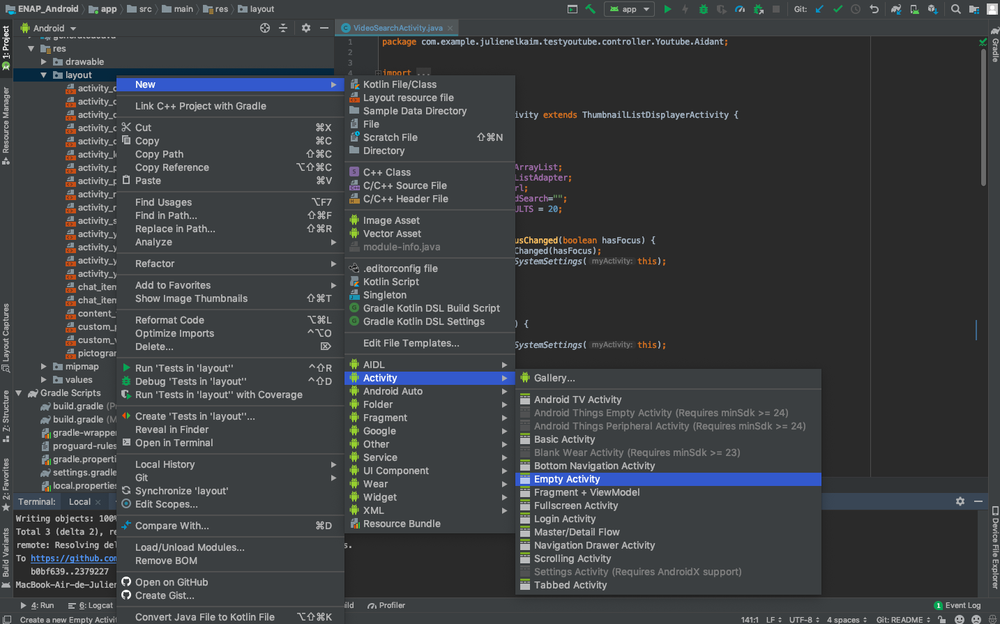
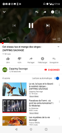

# Projet Android ENAP: V 1.0.0
<br>
<br>  

## Contexte et objectifs du projet

L'application a pour objectif de permettre aux autistes de profiter des ressources d'internet dans le cadre d'un apprentissage encadré. ses objectifs sont : 
<br>
<br>

____
<br>  

**Premier objectif:** simplifier les interfaces des sites internets les plus visités pour éviter aux enfants de souffrir de la surcharge d'information que l'on trouve sur les sites d'information.  
 
**Sites traités en v1.0.0:**  
- Wikipédia [Voir plus](#Wikipédia)   
- Youtube [Voir plus](#Youtube) 
<br>

<br>  

**Second objectif:** proposer un système de messagerie simplifié, adapté à des enfants non communicants. [Voir plus](#Mails)
<br>
____

<br>
<br>  

## Auteurs

Convention : *Author - email address : speciality*

### ENAP -v 1.0.0
__________________________________
<br>  

**Julien Elkaim**   - julienelk@gmail.com       : Youtube **[Nb: 3A Nancy 2019 - 2020]**  

**Rayan Zaibet**    - rayananana@gmail.com      : Wikipédia  

**Mathis Fouques**  - mathis@gmail.com          : Mails  

<br>  

### ENAP -v 1.0.0  

__________________________________  

<br>  

*2019 - 2020*  

<br>  


__________________________________  


<br>
<br>
## Conventions du projet

<br>
**Architecture**: L'architecture des projets Android est directement inspirée de l'architecture MVC. Pour en savoir plus sur la MVC, [Cliquez ici](#mvc_tutorial)  

**D.R.Y** : Don't Repeat Yourself. Si des classes partagent leur logique (Exemple: Deux activités destinées à afficher une liste de vidéos), il vaut mieux créer une classe mère dans le plus de décliner les méthodes, quitte à faire des *overrides*. Pour plus de fluidité dans le parcours des classes, encapsulez ces classes mères dans un sous package **MotherActivity**.

**Nommage explicite** : Toujours choisir des noms de variable et de méthode qui décrivent précisément l'objet et sa fonction. Cela évite de perdre des heures sur la maintenance du code ou voulant intégrer de nouvelles fonctions à un code pré-existant.

**Structrer son code en modules** : Les objets Activity peuvent vite s'accumuler et rendre le dossier des *controllers* illisible. Pour rendre le parcours du code plus lisible, il faut organiser ses java class en packages. Le choix fait en v 1.0.0 est d'organiser le code par fonctionnalité *(Ex: Youtube, Youtube.Aidant, Wikipédia, Mails, Auth)*. 


 

**Commentaires JavaDocs** : Utilisez en priorité la Java Doc pour exprimer l'utiliter de la fonction, les inputs et outputs. Il faut que pouvoir comprendre la fonction sans avoir à lire le code.  
***Exception faite des fonctions en override, Il vaut mieux ne pas overrider la JavaDoc initiale***.
<br>


```java
	/**
	* @author Julien Elkaim
	*
	* Square any integer passed in parameter.
	*
	* @param nb, number to square. 
	* @return number squared by this tremendous function.
	*/
	private int squareIt(int nb){
		return nb*nb;
	}
```  


## Tutorials  


###Architecture MVC  


L'architecture MVC est très utilisé dans les applications web et mobile. Elle part du principe que le code est beaucoup plus maintenable si les différentes fonctions de l'application sont divisés entre différents objets (Ici, des simples classes Java, ou des fichiers xml):  

**M - Model**, gère les intéractions avec la base de données. Conceptuellement, on considère le modèle comme une interface pour simplifier l'accès aux donnée. Dans les faits, le Model est une simple classe Java. Une fois un objet initialisé avec le patron de cette classe, il est possible de manipuler les informations facilement grâce aux *setters* et aux *getters*. Si il y a besoin d'appliquer des fonctions bien spécifiques à cet objet, il vaut mieux en faire des méthodes. **Si l'application était un corps humain, les modèles seraient la mémoire, ou plutôt la partie du cerveau qui gère la mémoire.**
<br>
<br>

```java
package com.example.julienelkaim.testyoutube.model.Youtube;

public class Video {

    private String videoId, title, description, url;

    /**
     * @author Julien Elkaim
     *
     * @param videoId is the Youtube ID of this video
     * @param title is the youtube title of this video
     * @param description is the youtube description of this video
     * @param url is the url of this video
     */
    public Video(String videoId, String title, String description, String url) {
        this.videoId = videoId;
        this.title = title;
        this.description = description;
        this.url = url;
    }


    /**
     * @author Julien Elkaim
     *
     * @return youtube id of this video
     */
    public String getVideoId() {
        return videoId;
    }

    /**
     * @author Julien Elkaim
     *
     * @return youtube title of this video
     */
    public String getTitle() {
        return title;
    }

    /**
     * @author Julien Elkaim
     *
     * @return youtube description of this video
     */
    public String getDescription() {
        return description;
    }

    /**
     * @author Julien Elkaim
     *
     * @return url to display video.
     */
    public String getUrl() {
        return url;
    }

}
```
<br>
<br>

**V - View**, gère l'affichage de notre application. À moins d'avoir besoin de faire de l'affichage dynamique, c'est dans cette partie que vont être géré le contenu visible, la structure de ce contenu et c'est principalement dans la view, que sont gérés les interactions avec l'écran tactile. Les views sont des fichiers xml avec des conventions bien spécifique de nommage. **Si l'application était un corps humain, les views seraient le corps lui même et ses organes, soit la chair et les os.**
<br>
<br>


**C - Controller**, gère toute la logique métier de l'application. Concrètement, c'est ici que l'on définie les actions en réaction à un click d'utilisateur. C'est le **controller** qui demande à un **model** de faire l'interface avec les données pour pouvoir les utiliser et dire à la **view** comment les afficher. Le controller est la partie centrale de l'application, tout ce qui est "comportement", ou "intelligence" se définie ici. Dans android studio, *les controllers sont appelés des Activity*. Une Activity doit toujours hériter d'une classe mère de type Activity fournie par Android. **Si l'application était un corps humain, les controllers seraient le cerveau en excluant la partie mémoire, c'est lui qui dit au corps comment bouger, qui fait appelle à ses souvenirs pour décider ensuite d'agir.

```java
package com.example.julienelkaim.testyoutube.controller.Youtube.Aidant;

import android.content.Intent;
import android.support.v7.app.AppCompatActivity;
import android.os.Bundle;
import android.view.View;
import android.widget.ImageButton;

import com.example.julienelkaim.testyoutube.R;
import com.example.julienelkaim.testyoutube.toolbox.GlobalBox;

public class PlaylistCreatorDispatcherActivity extends AppCompatActivity {

    ImageButton newPlaylistBtn;
    ImageButton actualPlaylistBtn;

    @Override
    protected void onStart() {
        super.onStart();
        GlobalBox.windowAndSystemSettings(this);
    }

    @Override
    protected void onRestart() {
        super.onRestart();
        onBackPressed();
    }

    @Override
    protected void onCreate(Bundle savedInstanceState) {


        super.onCreate(savedInstanceState);
        setContentView(R.layout.activity_playlist_creator_dispatcher); //C'est ici que le controller sait à quelle vue il est associé.

        newPlaylistBtn = findViewById(R.id.new_playlist_btn);
        newPlaylistBtn.setOnClickListener(new View.OnClickListener() {
            @Override
            public void onClick(View v) {
                // Se connecter a l'activité lecteur youtube
                Intent myGame = new Intent(PlaylistCreatorDispatcherActivity.this, PlaylistCreatorActivity.class);
                startActivity(myGame);
            }
        });
        actualPlaylistBtn = findViewById(R.id.actual_playlist_btn);
        actualPlaylistBtn.setOnClickListener(new View.OnClickListener() {
            @Override
            public void onClick(View v) {
                Intent myPlaylists = new Intent(PlaylistCreatorDispatcherActivity.this, PlaylistCreatorGetterActivity.class);
                startActivity(myPlaylists);

            }
        });

    }

    }

```
<br>
<br> 

Si ce tutoriel n'est pas suffisant, n'hésitez surtout pas à me contacter : 
 
``` 
julienelk@gmail.com - 2018		//À mettre à jour tous les ans
```  

<br>
<br>  

____  

### API Requests  

Les requêtes sur API REST se font à travers la librairie **volley**. Le traitement d'une réponse en JSON se fait avec la librairie **gson**.

```gradle
implementation 'com.android.volley:volley:1.1.1'
implementation 'com.google.code.gson:gson:2.8.2'

```  

Volley traite les requêtes de manière asynchrone, c'est à dire que le programme n'attendra pas que l' API lui réponde pour éxécuter le reste du code.

Pour lancer une requête il faut utiliser un objet **RequestQueue** auquel on passe un objet **strinRequest**. Ce dernier utilisera une fonction *(ici, fonctionPourTraiterLaReponseDeLApi)* pour traiter la réponse.

```java
	// Fonction a lancer depuis n'importe quel méthode d'une Activity
	RequestQueue rqQueue = Volley.newRequestQueue(getApplicationContext());
   // Définir les paramètres de requête et la manière de traiter
   StringRequest stringRqQueue = new StringRequest(
                Request.Method.GET,
                mSearchUrl,
                new Response.Listener<String>() {
                    @Override public void onResponse(String response) {
                        fonctionPourTraiterLaReponseDeLApi(response); }
                    },
                new Response.ErrorListener() {@Override public void onErrorResponse(VolleyError error) {
                    Toast.makeText(getApplicationContext(),error.getMessage(), Toast.LENGTH_LONG).show(); } 
                }
        );
        rqQueue.add(stringRqQueue);
```

Ensuite il suffit de traiter la réponse (en JSON si c'est une API REST) dans la fameuse fonction passée, *ici, fonctionPourTraiterLaReponseDeLApi*.  

```java
private void processRequestResponse(String response) {
        try {
            JSONArray jArray = new JSONObject(response).getJSONArray("items");
            // JSONArray or JSONObject depending the JSON root : [] or {}
            //Some stuff on the jArray object
            


        } catch (JSONException e) {
            e.printStackTrace();
           //Or any strange way to handle errors on the JSON object.
        }

    }

```
<br>
<br> 

Si ce tutoriel n'est pas suffisant, n'hésitez surtout pas à me contacter :  
 
``` 
julienelk@gmail.com - 2018 	//À mettre à jour tous les ans
```  

<br>
<br>  
____  

### Création des vues XML

La bonne pratique est de toujours construire une vue **avec** un controller. En effet, 90% du temps vos vues auront besoin d'un controller pour les générer, à moins que vous ne décidiez de faire des *partials*, ce qui est une utilisation avancée des vues.  

Créer un duo View-Controller se fait en deux clicks grâce à Android Studio:  

  

Ils vont ensuite vous demander de nommer votre activity. Ici, suivez simplement la convention de nommage du projet.
<br>
<br> 

Si ce tutoriel n'est pas suffisant, n'hésitez surtout pas à me contacter :  

``` 
julienelk@gmail.com - 2018  	//À mettre à jour tous les ans.
```  

<br>
<br>  

____  

### Utilisation de Firebase

/* MATHIS */
____  

### Youtube Player - Lib

[Téléchargez la librairie YouTubeAndroidPlayerApi-1](https://developers.google.com/youtube/android/player/downloads/YouTubeAndroidPlayerApi-1.2.2.zip). 

**Pendant le téléchargement**, déplacez vous dans le dossier contenant le projet android (dedans vous trouverez des fichiers/dossiers tel que : app, gradle, build.gradle, etc...). Ici, créez un dossier APIaddedByMe (ou le nom qu'il vous plaira).

**Après le téléchargement**, copiez-collez le dossier téléchargé (**dézippé**) dans APIaddedByMe (ou votre nom de dossier).  

**Une fois le dossier déplacé**, ouvrez le build.gradle de l'application:  

- Graphiquement : Le plus haut au niveau de l'arborescence du projet.  
- Sur Android Studio: Dans la section Gradle Scripts, le fichier build.gradle (Module: app).  

Android Studio vous demandera de réaliser une synchronisation du projet en haut à droite, **lancez la synchronisation**. Une fois terminée, vous êtes capable d'utiliser des objets Youtube Player !  
<br>
<br> 

Si ce tutoriel n'est pas suffisant, n'hésitez surtout pas à me contacter :  

``` 
julienelk@gmail.com - 2018  	//À mettre à jour tous les ans.
```  

<br>
<br>  

____  


## ENAP - Parties  


### Youtube 
 

#### Partie Enfant  

La partie de l'application concernant youtube a comme objectif de retirer toutes les informations marketing du site :  

 <-- Youtube | ENAP -->  


L'objectif est de supprimer le surplus : Les propositions de vidéo, les boutons d'interaction( partager, s'abonner, etc...), les publicités avant et pendant la lecture de vidéo. Le but est donc de proposer l'interface la plus minimaliste possible. Le choix a été fait de :  

- Garder des boutons Play/Pause | Avant/Arrière
- Afficher l'état d'avancement dans la playlist de lecture (pour coller à la méthode A.B.A)
- Proposer un bouton "Retour en arrière" pour ne pas frustrer l'enfant de devoir rester sur cette page.

La partie enfant est donc totalement limitée à un lecteur de vidéo, le choix des vidéos et le déclenchement des playlists est laissé à l'aidant.

#### Partie Aidant  

L'aidant doit pouvoir gérer plusieurs playlists en même temps. Il doit pouvoir envoyer une playlist à n'importe quel enfant à sa charge.

  |   

Il doit également pouvoir les modifier quand il le souhaite,  

  |  |    

ou en créer une rapidement, soit à partir d'une playlist youtube existante, soit en créer une depuis zéro.  

  |  |   

<br>
<br>
<br> 

Si vous avez besoin de précision, n'hésitez surtout pas à me contacter :  

``` 
julienelk@gmail.com - 2018  	//À mettre à jour tous les ans.
```  

<br>
<br>  
<br>

**Reste à faire sur Youtube pour la v 2.0.0 :**
_____________________  

- Possibilité pour un aidant de gérer sa liste d'enfants à charge.
- Envoie par Firebase d'une playlist à un enfant à charge.

_____________________  


### Mails  

/* MATHIS */

### Wikipédia  


/* RAYANE */